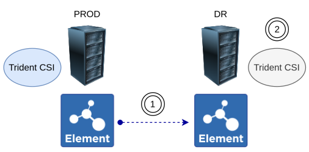
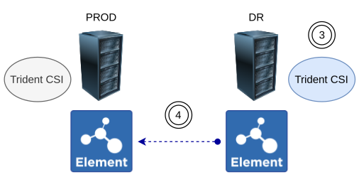
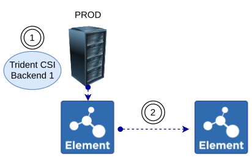
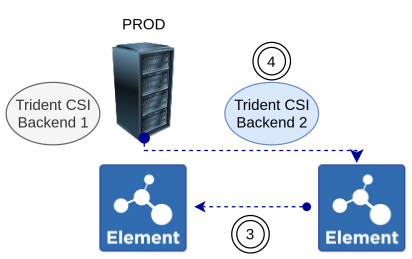
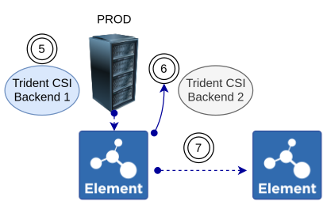
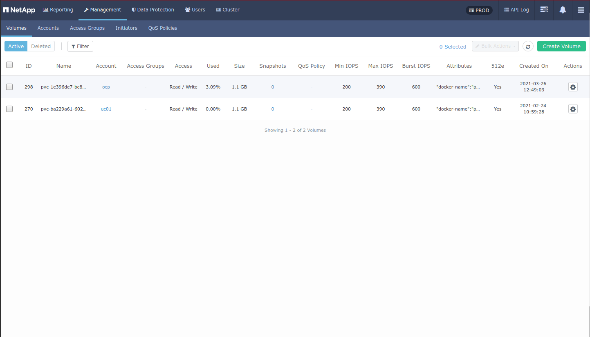
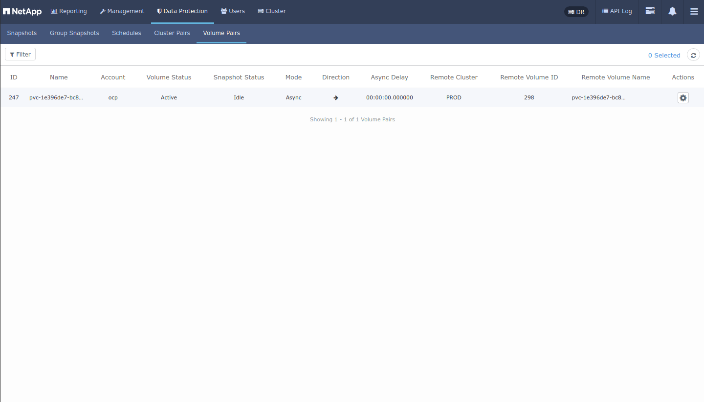

## kubefire -  NetApp HCI and SolidFire storage cluster failover and failback for SolidFire and Trident CSI users

- [kubefire -  NetApp HCI or SolidFire storage cluster failover and failback for Trident CSI consumers](#kubefire----netapp-hci-or-solidfire-storage-cluster-failover-and-failback-for-trident-csi-consumers)
- [Introduction](#introduction)
- [SolidFire CSI scenarios](#solidfire-csi-scenarios)
- [Trident CSI Scenarios](#trident-csi-scenarios)
  - [Two Kubernetes-SolidFire pairs (recommended)](#two-kubernetes-solidfire-pairs-recommended)
  - [Single Kubernetes cluster attached to two SolidFire storage clusters (not recommended)](#single-kubernetes-cluster-attached-to-two-solidfire-storage-clusters-not-recommended)
  - [Tools and how to use them](#tools-and-how-to-use-them)
    - [Single source of truth: Kubernetes, Trident CSI or SolidFire](#single-source-of-truth-kubernetes-trident-csi-or-solidfire)
  - [Workflow for failover and failback](#workflow-for-failover-and-failback)
    - [Failover and failback with Kubernetes-SolidFire pairs](#failover-and-failback-with-kubernetes-solidfire-pairs)
      - [Features](#features)
      - [Requirements](#requirements)
      - [Limitations](#limitations)
      - [Risks](#risks)
      - [How it works](#how-it-works)
      - [Operational details](#operational-details)
    - [Failover and failback with single Kubernetes cluster (not recommended)](#failover-and-failback-with-single-kubernetes-cluster-not-recommended)
  - [Backup and restore integrations](#backup-and-restore-integrations)


## Introduction

Trident CSI unfortunately hasn't added site or storage cluster failover and failback features, or addressed some of the initial shortcomings, in its `solidfire-san` driver for close to a decade, so storage failover and failback aren't as convenient as they could be.

After years of waiting, I've decided to create own CSI driver, SolidFire CSI. It's not "better", it's just "different" and works the way I want. It's also not officially supported or certified for any Kubernetes distribution. But it may work better in some situations.

## SolidFire CSI scenarios

[SolidFire CSI](https://scaleoutsean.github.io/2026/03/06/solidfire-csi-driver.html) is a community CSI driver for SolidFire that, among other things, makes it easier to handle storage cluster failover and failback. That was one of the main reasons I created it.

You won't need any special "tool" or script to failover or failback, so you should simply check the documentation.

Long story short, each SolidFire CSI driver's `volumeHandle` refers to a SolidFire Volume ID. The rest is simply about creating volume pairs and deciding on the direction of replication.

### Externally managed SolidFire failover with Terraform or scripts

You can do that with Trident CSI today using the same tool that I plan to employ for SolidFire CSI, [Terraform Provider for SolidFire](https://github.com/scaleoutsean/terraform-provider-solidfire), but you'll have to deal with Trident CSI separately. 

SolidFire CSI gets out of your way: there are no "backends" or similar constructs that you need to manage or recover.

There's no "volume import" feature either, because SolidFire CSI is stateless. So once you're done flipping the direction of replication, just create static PVCs which, considering that you have all the volume IDs and hence their names and Kubernetes information, too, is straightforward.

**NOTE:** as usual, destination volumes are always in `replicationTarget` mode, which means Kubernetes on the target site should have deployments scaled down to 0, or not created until failover happens and the volumes are flipped to `readWrite` mode.

### Kubernetes-integrated SolidFire failover

This hasn't been done yet, as SolidFire CSI is yet to be posted to Github. It should be doable by anyone, but I'm not going to spend time on this unless someone needs it. 

My preferred approaches (not in order of preference) are Argo CD (or similar) on eachsite, and a "witness site" approach with management plane where failover decisions are made by tenants using a CLI or Web UI located on "witness site". I haven't started working on this as I don't know of anyone who needs this.

### Volume resizing

- This should be managed separately and not figured out "as you go" in the middle of a site failover. Although SolidFire CSI and Ansible, and Terraform make this easy, the risk isn't that it can't be done in course of troubleshooting a fail-over or fail-back, but that enlarged target volumes won't be replicated to destination that hasn't been resized to the same (or larger, although that's silly) capacity. That's why it's recommended to have this in order and managed separately from failover-failback
- You may use own scripts, obviously, or Ansible (to get facts) or [Longhorny](https://github.com/scaleoutsean/longhorny)
- Longhorny provides an easy site-to-site comparison report, but it can also be used to resize volumes although this doesn't mean you should use Longhorny to resize (depending on where you want to manage volumes (see below), resizing in Longhorny may be the wrong way to do it). The main thing that is valid for Kubernetes and SolidFire CSI environments is that *report*. You can also reuse that source code to build own tools
- For the geeks out there, you could use SolidFire Collector to figure out pairings and find size discrepancies among paired volumes using InfluxDB SQL queries, either directly or from Grafana dashboards where you could also create alerts for these situations

### Static PV pattern: cattle vs pet volumes

While some prefer to manage everything in Kubernetes, many users still prefer to manage volumes as "pets".

- Pet volumes: pre-create source *and destination* volumes with [Ansible Collection for SolidFire](https://github.com/scaleoutsean/netapp.solidfire) or [Terraform Provider for SolidFire](https://github.com/scaleoutsean/terraform-provider-solidfire) or own script. Then import static volumes to SolidFire CSI on each site. Now failover and failback is simply a matter of flipping the direction of replication (volume pairing relationship). Note that you can resize volumes in SolidFire CSI, which then makes the reality out of sync with Terraform's state, so pick one way to do it, make sure it works the way you expect, and stick with it
- Cattle volumes: don't replicate these. These are semi-ephemeral - you don't need a copy and their replication consumes bandwidth
- Remember to set "pet" PVCs to "Retain". SolidFire CSI also provides the option to not Purge volumes on PVC Delete when retention policy is Delete (Trident CSI always purges deleted volumes with `solidfire-san`) if you want to use the retention policy "Delete" but be able to rescue fat-fingered volumes before they expire from SolidFire's Recycle Bin. Deleted but not-yet-purged voulmes can be restored and brought back to Kubernetes with SolidFire CSI as static PVCs

### Dynamic PV pattern: Kubernetes-managed replication

If you want to use Kubernetes-based workflow (GitOps, ArgoCD, etc.) as your control plane, that's possible and easy with Trident CSI.

SolidFire CSI has no "backend", provides sufficient tools to make this work and doesn't stand in your way. A volume is defined by MVIP (which uniquely defines a SolidFire cluster) and `volumeHandle`. All you need to do to replicate any volume between clusters is get a list of volumes and set them up for replication.

To flip back:
- get a list of SolidFire CSI volumes at the remote site and compare to see if anything changed while operating on the remote site (new volumes, removed volumes)
- if any new PVCs/PVs exist, create new replication relationships so that all volumes are accounted for and replicating for failback
- if any pre-failover PVCs/PVs have been removed, find out why and whether it's OK to remove them at the site you plan to fail back to (or do that later)
- the last step is to check for any size differences in replicated volume pairs, which may appear due to resizing while operating at the remote site. You should have a separate procedure that updates both sides of a replication relationship and not have to "discover" this now. If any volume has been expanded while active on fail-over site, expand its source peer on the site that you plan to fail back to and let it sync
- with the original source site volumes in `replicationTarget` mode, once all replication pairs are in sync, scale the active (remote) site to 0, flip replication relationships to promote the original site to active and seconds later you may fail back your workloads by scaling up deployments on your primary site

### Rehearsals and testing

With SolidFire CSI you won't need to deal with stuck backends or other weirdness. If your volumes are replicating to a remote site it's trivial to perform site or storage cluster failover rehearsals:

- on replication target site, simply create a test namespace, clone volumes, create static PVs from clones, test your application and delete them after you're done testing
- CSI volumes can be cloned directly from replication targets (in `replicationTarget` mode) but also from SolidFire snapshots
  - if you create snapshots and enable them for replication at the source, you'll be able to use them (perhaps you create these so that they're [application-aware](https://scaleoutsean.github.io/2024/03/23/velero-netapp-verda-scripts-and-trident.html)). If not, you can create snapshots on demand or simply clone current state of a replication target (obviously, this will be a "cash-consistent" clone). 
  - you can create clones from volumes at the target site. While this is *ad hoc*, it will work just the same
- use a "purge"-enabled Storage Class on SolidFire CSI if testing at scale, to not max out your tenant's quota or hit some other limit (metadata capacity, block capacity, etc.)
- SolidFire CSI on the remote site simply needs to create static PVs for these clones

### Other noteworthy differences vs Trident CSI

- It is recommended to create a mapping for QoS policies if you use those. You can have those hard-coded in SolidFire Storage Classes, so that you don't have to do anything special: if "Silver" is QoS Policy ID `1` at your production site and `2` on your DR site cluster, simply prepare storage classes that are named the same, but use different QoS Policy IDs. If you don't do that, you can use "default" SolidFire QoS values for volumes and not manage QoS. Or you can ignore QoS management and retype volumes after failover if you discover you need to use that site longer than expected - SolidFire CSI can do that too

### Site failover with dedicated vs. shared SolidFire clusters

If your SolidFire cluster is shared by several Kubernetes clusters, you should consider if your failover scenarios should include just some of the tenants (two or more Kubernetes clusters) or all tenants (all Kubernetes clusters, or single Kubernetes cluster).
- Different Kubernetes clusters should use SolidFire each with own SolidFire account (tenant) identity.
- For granular failover (of individual SolidFire tenants), you need to flip just volume pairs owned by those tenants. Longhorny is suggested for monitoring because while it can flip the direction of replication, it does it for *all paired volumes* (and hence all tenants). It would need to enhanced to filter by tenant account ID to be able to used for simple tenant(s)-based site failover. Of course, that can be implemented, but it hasn't been done yet

## Trident CSI scenarios

Unless you have no choice, I'd recommend to not consider Trident CSI with SolidFire backend in storage replication scenarios involving SolidFire. You may want to look into the improvements related to the volume import feature of Trident CSI (no rename, etc.) from recent years - maybe that will help you a bit, if it at all works with `solidfire-san`.

Information below is not going to be updated, but it will remain here for curation purposes.

### Two Kubernetes-SolidFire pairs (recommended)

This approach works better as each site has one fixed Trident CSI back-end.

- (1) Pair volumes for replication. You may use my [Terraform Provider for SolidFire](https://github.com/scaleoutsean/terraform-provider-solidfire) or other (including your own) tool or script.
- (2) When backup site needs to take over, stop replication and import volumes to Kubernetes at the secondary site



- (3) If new workloads are added, add them to reversed replication pairs to be ready for fail-back



This approach is "symmetric" in the sense that failover and failback have the same workflow.

### Single Kubernetes cluster attached to two SolidFire storage clusters (not recommended)

In this scenario a single Kubernetes cluster is attached to two SolidFire storage clusters, one of which is replicating to the other.

- (1) Kubernetes uses Trident CSI with the primary array as its sole backend
- (2) SolidFire replication replicates PVCs from the primary to the secondary array



- (3) Upon storage failover, direction of replication is reversed
- (4) Kubernetes adds another Trident backend (the secondary array) and imports replicated volumes (now in readWrite mode)



- (5) This is the problem step with this approach: once a Trident back end pointing to the primary SolidFire goes down, even after SolidFIre recovers, the backend remains stuck and the only way to revive it (that I know of as of Trident CSI v24.06) is to uninstall and install Trident again



- (6) Volumes are imported and replication set up as it was originally

This approach is crude and "asymmetric" in the sense that failover and failback work very differently the first time (and in a complicated way after that).

### Tools and how to use them

- [Longhorny](https://github.com/scaleoutsean/longhorny) - Python tool that can pair clusters and volumes, initiate and reverse replication. See a [demo here](https://scaleoutsean.github.io/2024/06/11/introducing-project-longhorny.html#demo). 
- Kubernetes-to-Trident-to-SolidFire volume mapping - the script is located in the scripts directory of Awesome SolidFire repo on Github. See [this blog post](https://scaleoutsean.github.io/2024/06/01/pvc-volume-relationships-in-solidfire-trident-part-1.html). Kubefire does all that and more, but if you need a simple and short script that maps Trident to SolidFire configuration, check it out
- [Terraform Provider for SolidFire](https://github.com/scaleoutsean/terraform-provider-solidfire) can help you with cluster and volumes' pairing, but you'll need to deal with Trident CSI on your own (I'm not going to look into Trident CSI in the context of SolidFire - I'll focus on SolidFire CSI).

Longhorny can help you easily setup and reverse replication relationships between SolidFire clusters and their paired volumes.

Currently (but this may change) Longhorny doesn't consider individual SolidFire tenant accounts (which would be more than one if a site has more than one Kubernetes cluster attached to SolidFire storage) and when Longhorny reverses the direction of storage replication all tenants' and volumes' replication is reversed. This is fine if you have a single tenant with no more than one cluster but not good enough if there are multiple Kubernetes clusters or Kubernetes and non-Kubernetes tenants with replicated data. Kubefire users probably don't need Longhorny - and vice versa - but it has extensive notes on various SolidFire replication-related details and instructions for users who wish to build test environments with SolidFire Demo VMs.

#### Single source of truth: Kubernetes, Trident CSI or SolidFire

In both of the main scenarios we rely on storage (SolidFire) replication to copy volume data between sites, so that part is fixed.

But in order to set up SolidFire volume pairs (i.e. replication), we need a list of volumes.

We can get that list from Trident CSI (which is what that volume mapping script just above does), or we can get it from Kubernetes, by getting the list of PVCs in selected (or all) namespaces. 

Trident CSI may have some stale or unnecessary volumes - for example, PVCs that remain after deletion, but are no longer in use on Kubernetes - so the "risk" is we may end up replicating more volumes and more data than necessary. On the other hand, we're less likely to miss certain volumes than by getting the list directly from Kubernetes namespaces and PVCs.

Lists produced by the Trident API or `tridentctl` seem more reliable and any errors would be on the safe side while omissions should be impossible. Because of that and no major downsides I currently favor that approach. 

It is possible to get volume lists from both `kubectl` and `tridentctl`, work with the latter and warn on any discrepancies, but I haven't seen a situation in which that may be necessary.

The value of `kubectl` output is Kubernetes-related configuration (namespaces, services, pods, stateful sets, etc) so we still need that information, just not necessarily for storage replication-related workflows.

### Workflow for failover and failback

#### Failover and failback with Kubernetes-SolidFire pairs

##### Features

- Storage-only protection for Kubernetes volumes that's largely independent from Kubernetes (aside from the inputs required to know what to replicate)
- Utility to dump Kubernetes (PVC, PV), Trident and SolidFire volume configuration for specific backend (K8s, Trident) and SolidFire tenant
- Can set up volume replication between paired SolidFire clusters based on Kubernetes cluster, Trident backend and SolidFire storage tenant account
- Utility to fail over SolidFire in seconds. Time required to replicate volumes or changes is separate and may be from minutes as SolidFire always uses differential synchronization in independently of the direction
- Can create "missing" new volumes at the destination and resize existing replica volumes on the remote SolidFire cluster
- Security is not an exercise for the user: no credentials in data-at-rest, end-to-end encryption, easy to secure
- Fencing-like feature to take over locally and prevent another instance of Kubefire from modifying SolidFire configuration
- Unlike [Longhorny](https://github.com/scaleoutsean/longhorny) which has no Kubernetes-specific features and treats the entire SolidFire cluster as a "unit of failover", Kubefire performs slightly fewer checks, is Kubernetes- and Trident-aware, works on Kubernetes cluster and SolidFire storage account-level, but requires slightly more care and skill to operate
- Text, markdown and HTML reports can be generated for viewing, logging and other purposes

##### Requirements

- Kubernetes: tested with v1.30.2
- Trident CSI: tested with v24.06
  - Dynamic CSI volumes - OK
  - Block & filesystem PV volumeMode - OK
  - 0, 1 or 2 PVCs per namespace - OK
  - Ephemeral PVCs - OK
- SolidFire: tested with v12.5 (all v12 should work)
  - Kubefire aims to allow each storage (tenant) account to have several clusters
  - Trident CSI has a setting for volume prefixes, but that should be optional for Kubefire because Kubefire relies on Trident's backend UUID which should enable replication of different Kubernetes clusters using the same SolidFire storage account to flow in the opposite or same direction
- S3 bucket: any (tested with a MinIO release from July 2024)
  - "Standard" S3-compatible object store bucket. 
- Configuration:
  - SolidFire and Trident configuration on the remote site should be in working condition (SolidFire account, worker nodes' iSCSI configuration, network, storage classes, namespaces, etc.) as Kubefire does not replicate 
  - Given that Trident officially does not support retyping of PVCs (e.g. from Gold to Silver), types at the destination site ought to have the same names, although their IOPS settings can be different from the source site

The list above may not be complete and may be improved by contributors.

##### Limitations

There may be others, but these are the ones I'm aware of or find important enough to mention:

- Kubernetes
  - `HonorPVReclaimPolicy` (first available by default in v1.31) make it possible to avoid situations with "orphaned" volumes, but as enterprise Kubernetes are always behind, it will take some time until the problem of wrongly orphaned PVs goes away. Kubefire doesn't depend on, or make us of, that feature. The working assumption is PVs may stick around and that may be right or wrong, so we don't want to decide if we should delete them
  - Stateful Sets - Kubefire will setup replication for PVs from included namespaces with Stateful Sets, but - as usual - it will not delete such replication relationships if a SS is scaled down, which can result in orphaned replication relationships that need to be cleaned up manually. If SS with autoscaling or frequent down-scaling is used, it may be better to retain PVCs and reuse them.
- Snapshots on source volumes paired for replication are not replicated 
  - Trident CSI snapshots can't even be tagged for replication using a standard approach, so if a volume is paired using "snapshotsOnly" replication mode and a Trident CSI snapshot taken, that won't do anything in terms of replication. "Include snapshot in volume replication" option for SolidFire snapshots is off by default and Trident CSI has no setting that can enable this. In order to replicate Trident snapshots you can list existing snapshots for Kubefire source volumes and modify selected (or all) snapshots to enable their replication. List of Kubefire volumes can be obtained by parsing or importing Kubefire reports (which list SolidFire-replicated volumes) or based on your own logic. Kubefire could add this feature if necessary.
  - Some users may find that acceptable and prefer this approach. For example, you may use site-specific backup software and take just local snapshots on each side, or even copy them to S3. So when and if you need them at the other site you can get to them from the other cluster. This approach offers clearer separation of concerns between storage and backup, but has a longer RPO/RTO.
- There's no feature to protect volumes based on Kubernetes labels and such. This is by design, but may changed. If the Kubernetes user needs that level of integration and coupling, that should be done natively on Kubernetes and for small-to-mid-sized volumes it's easy enough with Velero, Kasten and other backup & recovery applications.
- Before fail-back that involves the syncing of volumes back to the original source SolidFire cluster, all in-scope volumes at the site need to be imported to Kubernetes. This shouldn't be a problem because if the volumes haven't been updated there will be no changes to sync back (you can just flip the sides from one to the other mode (readWrite, replicationTarget)). If the volumes *have been* updated or new volumes created at the remote site, then they were also imported to Kubernetes, so the only case where this "limitation" may be a problem is if SolidFire volumes were failed over, modified *outside* of Kubernetes and needed to be synced back, which simply isn't what anyone should want to do (you can clone replicationTarget volumes for that).

##### Risks

Care is taken to setup replication for SolidFire-backed PVCs from namespaces passed to Kubefire. We want to avoid failing over (or losing) a Kubernetes cluster in which (say) only 17 out of 19 volumes are replicated. At the same time Kubefire has the options that allow you to include and exclude namespaces which means "almost all are replicated" may in fact be correct and to know for sure we'd have to also look at namespace exclusion preferences and say "17 out of 19 isn't correct - 18 out of 19 should be replicated". This is yet another place where bugs can happen. Long story short, you need one or more of the following: generate Kubefire reports, visually inspect your setup, monitor replication (which you can do with SFC or other tool), test failover (an example workflow can be found in Q&A, below).

Kubefire doesn't delete volumes and even replication relationships orphaned at the source side (for example, when a PVC is deleted, the SolidFire volume may be deleted as well, but the remote replica will remain). It would be too much to assume what should and shouldn't be deleted and since snapshots aren't replicated the remote copy may be the only surviving copy which is why these decisions are left to the storage administrator. This can be automated, but it seems risky and defeats the purpose of having a remote replica.

##### How it works

- Dump utility for Kubernetes and Trident (executed separately) with access to kubectl and K8s configuration file dumps required Kubernetes and Trident configuration (without any credentials) to an S3 bucket
- Kubefire (which can be executed at a different location) downloads these configuration files from the S3 bucket and - knowing Kubernetes, Trident and SolidFire (local and remote) configuration - parses this information and creates or updates replicated volume pairs
  - New PVCs are not yet paired, so Kubefire create those SolidFire remote volumes and pairs them automatically
  - Existing volume pairs are untouched, unless the source has been resized in which case the target volume is automatically resized as well
- To fail over a Kubernetes cluster from one site to another, stop Kubernetes workloads at the source (if possible), stop Kubefire (if possible), and execute SolidFire storage failover (which merely means swapping access modes on selected volumes owned by particular SolidFire account), and import volumes at the destination cluster by loading it from the dumped PVC JSON files from S3
- To fail back, wait until SolidFire completes replicating delta changes to the original source site, scale down workloads to zero at the remote site, and finally use the same fail-over procedure in the other direction (stop Kubefire, start Kubefire in the opposite (original) direction)

Kubefire does **not** delete SolidFire volumes or (remember, S3) any Kubernetes or Trident stuff because it has **no access* to Trident or Kubernetes. The Kubernetes and SolidFire administrators are responsible for:
- Deleting junk (e.g. Retain'ed) claims and PVs from Kubernetes/Trident
- Deleting junk SolidFire volumes
- Kubefire provides PVC, PV and SolidFire volume count to help the administrators keep an eye on volume count across "active" Kubernetes and the both SolidFire clusters (the remote Kubernetes may not even exist, until it's installed, but information for the source site is available from dumped Kubernetes and Trident configuration files). Additionally, you may use [SFC](https://github.com/scaleoutsean/sfc) or other monitoring tool to watch these stats and set up alerts (for the cases like there being 30 more SolidFire volumes than Kubernetes PVCs, for example)

##### Operational details

**Q: How to remove a SolidFire volume pairing relationship** 

**A**: Kubefire may recreate it if it's running, so first remove the PV (which may be done by removing the PVC, unless the SC has `Retain`), then unpair volumes on SolidFire. If the SC is `Delete`, Trident will purge the volume and snapshots from SolidFire. For `Retain` SCs you may need to remove the volume from Trident and SolidFire manually, but remember to backup or clone any SolidFire snapshot that you want to keep. If you want to keep the volume and just remove the relationship, restart Kubefire with the namespace that contains the volume excluded, which will make Kubefire ignore the volume. Then you can manually remove the pairing relationship and SolidFire will not create it again. `tridentctl` has the `delete` command, just be very careful not to use `--all` (which would *purge* all Trident-controlled volumes).

```sh
tridentctl delete volume <name>
```

**Q: How to remove a SolidFire volume** 

**A**: For "source-side" volumes, remove Kubernetes/Trident references and then remove the volume from SolidFire. It will be removed automatically by Trident if the SC has `Delete` rather than `Retain`. If it's paired, you'll need to unpair it on both source and destination before (better) or after (creates a temporarily "one-sided" pairing relationship until you (or Kubefire) remove the relationship) you've deleted it. Because Kubefire does not delete volumes, you will have to manually remove the "destination-side" volume. You should be able to find mismatched/orphaned volumes in Kubefire's reports or with Longhorny's `volume --mismatched` (which shows asymmetric pairing relationships between two clusters regardless of account ID or other details specific to Kubernetes).

**Q: How to make all account's volumes for backend UUID `xyz` consistently readWrite or replicationTarget?**

**A:** SolidFire can't filter by volume attributes, so flipping all volumes for the account can be done **if** you the account has a single Kubernetes cluster: in the SolidFire UI select the account, click on its volumes, and change all from readWrite to replicationTarget or the other way around. If the account is used for multiple Kubernetes clusters, then you probably want to focus on one cluster at a time, so you need individual volumes. 

On source, volumes have been presumably created by Trident, so they have a backend UUID in their SolidFire volume attributes. But on destination the volumes may be freshly created and have no history of Kubernetes (never been imported to Kubernetes) so you need to work by volume names which you can get from volume relationships: 
  - On source Kubernetes cluster find PVs that SolidFire replicates to the destination
  - If volumes are paired and relationships correctly established you can get the list of volume IDs from either SolidFire cluster - e.g. for backend UUID `xyz` at the source site, volume ID 5 may be replicating to volume 10 at the destination. Create a list of destination volume IDs, e.g. 10, 11, 12, and flip those to another access mode. For the source site 
  - If the volumes are not paired, but merely exist, Kubefire may not be able to help you because there may be other volumes (from another Kubefire relationship, in similar situation) that also "just exist". Also, this should never happen because **if** Kubefire creates a remote volume it is only for the purpose of automatically creating a replication pair for new PVCs from the source. If a volume is successfully created, it should be in the right access mode, have the correct size, and the same 512e setting.  

**Q: If I want to be able to run Kubefire in two locations, how can I prevent Kubefire at the source site (kubefire1) from modifying SolidFire cluster at the destination? I want to take over at the destination site.**

Assuming you run a Kubefire at the source and that site intermittently goes down, you can change settings at the destination site (for example, you promote destination volumes to readWrite) - Kubefire from the source won't flip volumes from readWrite, it will simply exit with error once it sees inconsistent/invalid setup. 

But it's simple to exclude it - simply have two accounts on each SolidFire cluster, kubefire1 and kubefire2, and if you want to start Kubefire on the destination you can change the password for kubefire1 on the destination cluster to prevent Kubefire from the source site from accessing that cluster. This shouldn't be necessary, because if Kubernetes on each side has volumes set to readWrite, replication will stop and until one side in each pair is flipped to replicationTarget (which would presumably be necessary before failback, as volume data has been updated at the site that took over). So in this case the original source site has to recover (come back online), we need to switch its volumes to replicationTarget and then can restart either Kubefire instance with the correct `src` and `dst` parameters to continue (which it won't do unless each side has volume pairings correctly configured - readWrite for source, replicationTarget for destination).

**Q: How to test if replication is working correctly**

- Check that all source volumes are being replicated (use Kubefire report, write own, or compare `kubectl get pv` against SolidFire Data Protection > Volume Pairs)
- Create a "replication-enabled" group snapshot of all source volumes to get those snapshots replicated to the remote SolidFire cluster
- On the remote cluster clone those snapshots and assign them to another SolidFire tenant account (e.g. `sandbox`)
- Use a test Kubernetes cluster with Trident set to use that test account and import volumes for verification

#### Failover and failback with single Kubernetes cluster (not recommended)

This approach is discouraged because of its complexity.

To failover, we simply reverse the direction of replication, add the remote SoOlidFire as new Trident back-end and use Trident CSI to import PVCs from the secondary SolidFire. This entire procedure takes seconds if you have the inputs prepared.



- Ensure all volumes that used to be replicated from main-to-backup are now being replicated in the other direction
- When ready to fail back to the primary storage, terminate applications and remove PVCs (from the secondary storage), adjust Trident backends (that is, remove SolidFire cluster from the remote site, add SolidFire cluster from the main site), and the rest is the same - import volumes and start applications at the primary site.

One strange thing about failback is that it makes sense to reinstall Trident, rather than adjust Trident backends. There are two reasons for this:

- After failover (to the remote site), Trident backend delete (of the failed SolidFire cluster from the main site) doesn't complete which doesn't matter for failover but does leave the backend state stuck in `deleting`
- On failback, we cannot add the original SolidFire back-end from the main site because the same back-end is stuck in `deleting`
- If we were to failover again, we'd have the same problem with the backend from the remote site (it'd be stuck in `deleting` as well)

Because of that, it seems easier to me to reinstall Trident on failback. It takes 20-30 seconds to uninstall and install Trident, and the process of importing volumes and recreating applications takes another 10-20 seconds. 



The next failover to secondary storage should not require re-installation of Trident for the secondary SolidFire *if* failback to the primary storage was planned. That is, when we fail back, we can remove PVCs and the remote back-end before we fail back, so that the secondary back-end does not end up stuck.

Additional observations:

- Trident CSI's volume import feature can't import volume snapshots. The same happens if we reinstall Trident, add a backend and import volumes
- Due to Trident reinstallation we end up with new volume names every time we failover or failback. In volume details it is possible to see the static volume name from the backend, which is inconvenient for users who rely solely on Kubernetes PVC names (`kubectl describe pvc` can be used to obtain both the Kubernetes (`trident.netapp.io/importBackendUUID`) and SolidFire (`trident.netapp.io/importOriginalName`) volume name)
- If your environment has other back-ends (either SolidFire or ONTAP), reinstalling Trident may require additional steps to recover those back-ends and their PVCs as well

### Backup and restore integrations

Trident CSI volume import does not seem to play nicely with storage snapshots, but in most cases users have external backup software that does not depend on that anyway. Kubefire supports "snapshotsOnly" replication mode, so any storage snapshots enabled for remote replication are going to be replicated in all (Async, Sync and snapshotsOnly) modes.

If you're still concerned about being able to trace storage snapshots to PVC names and so on, [SFC](https://github.com/scaleoutsean/sfc) can collect information about snapshots and Trident volume attributes, so that you can look up previous PVC-to-snapshot relationships and get to those snapshots as long as they haven't been deleted.
