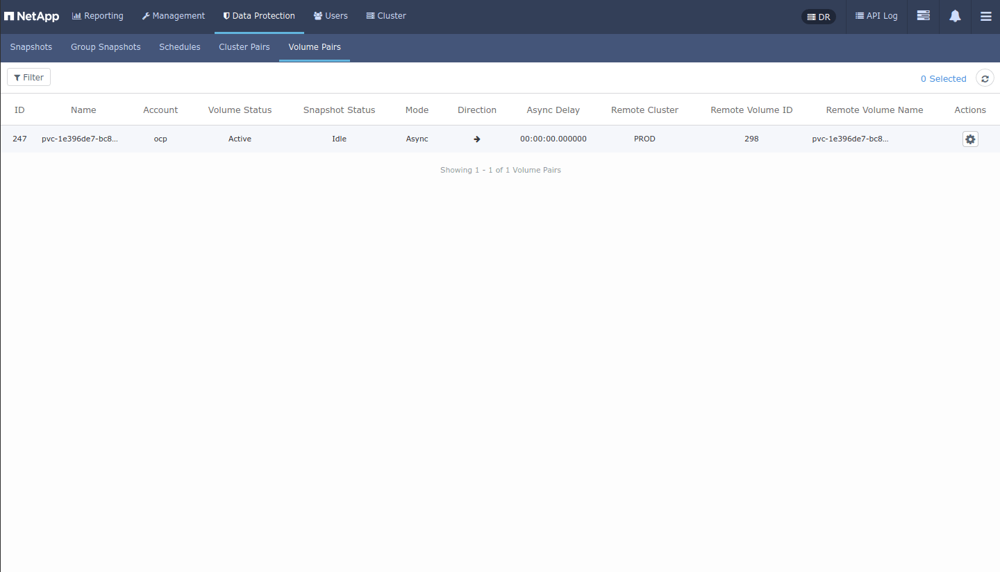

## kubefire -  NetApp HCI or SolidFire storage cluster failover and failback for Trident CSI consumers

- [kubefire -  NetApp HCI or SolidFire storage cluster failover and failback for Trident CSI consumers](#kubefire----netapp-hci-or-solidfire-storage-cluster-failover-and-failback-for-trident-csi-consumers)
- [Introduction](#introduction)
- [Scenarios](#scenarios)
  - [Two Kubernetes-SolidFire pairs (recommended)](#two-kubernetes-solidfire-pairs-recommended)
  - [Single Kubernetes cluster attached to two SolidFire storage clusters (not recommended)](#single-kubernetes-cluster-attached-to-two-solidfire-storage-clusters-not-recommended)
- [Tools and how to use them](#tools-and-how-to-use-them)
  - [Single source of truth: Kubernetes, Trident CSI or SolidFire](#single-source-of-truth-kubernetes-trident-csi-or-solidfire)
- [Workflow for failover and failback](#workflow-for-failover-and-failback)
  - [Failover and failback with Kubernetes-SolidFire pairs](#failover-and-failback-with-kubernetes-solidfire-pairs)
  - [Failover and failback with single Kubernetes cluster](#failover-and-failback-with-single-kubernetes-cluster)
- [Backup and restore integrations](#backup-and-restore-integrations)

## Introduction

Even in mid 2024 SolidFire is still the best NetApp storage for Kubernetes.

Unfortunately, Trident CSI hasn't added a feature or addressed some of the initial shortcomings for years, so storage failover and failback aren't half as convenient as they could be.

## Scenarios

While there are more scenarios than just these two, I suppose these are the main ones. 

### Two Kubernetes-SolidFire pairs (recommended)

This approach works better as each site has one fixed Trident CSI back-end.

- (1) Pair volumes for replication
- (2) When backup site needs to take over, stop replication and import volumes to Kubernetes at the secondary site

- (3) If new workloads are added, add them to reversed replication pairs to be ready for fail-back

This approach is "symmetric" in the sense that failover and failback have the same workflow.

### Single Kubernetes cluster attached to two SolidFire storage clusters (not recommended)

In this scenario a single Kubernetes cluster is attached to two SolidFire storage clusters, one of which is replicating to the other.

- (1) Kubernetes uses Trident CSI with the primary array as its sole backend
- (2) SolidFire replication replicates PVCs from the primary to the secondary array

- (3) Upon storage failover, direction of replication is reversed
- (4) Kubernetes adds another Trident backend (the secondary array) and imports replicated volumes (now in readWrite mode)

- (5) This is the problem step with this approach: once a Trident back end pointing to the primary SolidFire goes down, even after SolidFIre recovers, the backend remains stuck and the only way to revive it (that I know of as of Trident CSI v24.06) is to uninstall and install Trident again

- (6) Volumes are imported and replication set up as it originally was 

## Tools and how to use them

In 2024 I've restarted working on tools that make the process easier, especially the recommended approach with 1-to-1 Kubernetes-to-SolidFire mapping.

- [Longhorny](https://github.com/scaleoutsean/longhorny) - Python tool that can pair clusters and volumes, initiate and reverse replication. See a [demo here](https://scaleoutsean.github.io/2024/06/11/introducing-project-longhorny.html#demo)
- Kubernetes-to-Trident-to-SolidFire volume mapping - the script is located in the scripts directory of Awesome SolidFire repo on Github. See [this blog post](https://scaleoutsean.github.io/2024/06/01/pvc-volume-relationships-in-solidfire-trident-part-1.html)

Longhorny can help you easily setup and reverse replication relationships between SolidFire clusters and their paired volumes.

Currently (but this may change) it doesn't consider individual SolidFire tenant accounts (which would be more than one if a site has more than one Kubernetes cluster attached to SolidFire storage) and when Longhorny reverses the direction of storage replication, all tenants' replication is reversed. This is fine if you have a single tenant, but not good enough if there are multiple Kubernetes clusters or Kubernetes and non-Kubernetes tenants with replicated data. Adding the ability to specify storage account ID - or read it from Trident configuration file - isn't complicated, but needs to be added.

### Single source of truth: Kubernetes, Trident CSI or SolidFire

In both of the main scenarios we rely on storage (SolidFire) replication to copy volume data between sites, so that part is fixed.

But in order to set up SolidFire volume pairs (i.e. replication), we need a list of volumes.

We can get that list from Trident CSI (which is what that volume mapping script just above does), or we can get it from Kubernetes, by getting the list of PVCs in selected (or all) namespaces. 

Trident CSI may have some stale or unnecessary volumes - for example, PVCs that remain after deletion, but are no longer in use on Kubernetes - so the "risk" is we may end up replicating more volumes and more data than necessary. On the other hand, we're less likely to miss certain volumes than by getting the list directly from Kubernetes namespaces and PVCs.

Lists produced by the Trident API or `tridentctl` seem more reliable and any errors would be on the safe side while omissions should be impossible. Because of that and no major downsides I currently favor that approach. 

It is possible to get volume lists from both kubectl and tridentctl, work with the latter and warn on any discrepancies, but I haven't seen a situation in which that may be necessary.

## Workflow for failover and failback

### Failover and failback with Kubernetes-SolidFire pairs

TODO.

### Failover and failback with single Kubernetes cluster

This approach is discouraged because of its complexity.

To failover, we simply reverse the direction of replication, add the remote SoOlidFire as new Trident back-end and use Trident CSI to import PVCs from the secondary SolidFire. This entire procedure takes seconds if you have the inputs prepared.

- Ensure all volumes that used to be replicated from main-to-backup are now being replicated in the other direction
- When ready to fail back to the primary storage, terminate applications and remove PVCs (from the secondary storage), adjust Trident backends (that is, remove SolidFire cluster from the remote site, add SolidFire cluster from the main site), and the rest is the same - import volumes and start applications at the primary site.

One strange thing about failback is that it makes sense to reinstall Trident, rather than adjust Trident backends. There are two reasons for this:

- After failover (to the remote site), Trident backend delete (of the failed SolidFire cluster from the main site) doesn't complete which doesn't matter for failover but does leave the backend state stuck in `deleting`
- On failback, we cannot add the original SolidFire back-end from the main site because the same back-end is stuck in `deleting`
- If we were to failover again, we'd have the same problem with the backend from the remote site (it'd be stuck in `deleting` as well)

Because of that, it seems easier to me to reinstall Trident on failback. It takes 20-30 seconds to uninstall and install Trident, and the process of importing volumes and recreating applications takes another 10-20 seconds. 

The next failover to secondary storage should not require re-installation of Trident for the secondary SolidFire *if* failback to the primary storage was planned. That is, when we fail back, we can remove PVCs and the remote back-end before we fail back, so that the secondary back-end does not end up stuck.

Additional observations:

- Trident CSI's volume import feature can't import volume snapshots. The same happens if we reinstall Trident, add a backend and import volumes
- Due to Trident reinstallation we end up with new volume names every time we failover or failback. In volume details it is possible to see the static volume name from the backend, which is inconvenient for users who rely solely on Kubernetes PVC names (`kubectl describe pvc` can be used to obtain both the Kubernetes (`trident.netapp.io/importBackendUUID`) and SolidFire (`trident.netapp.io/importOriginalName`) volume name).
- If your environment has other back-ends, reinstalling Trident may require additional steps to recover those back-ends and their PVCs as well

## Backup and restore integrations

Trident CSI volume import does not seem to play nicely with storage snapshots, but in most cases users have external backup software that does not depend on that anyway. 

If you're still concerned about being able to trace storage snapshots to PVC names and so on, [SFC](https://github.com/scaleoutsean/sfc) can collect information about snapshots and Trident volume attributes, so that you can look up previous PVC-to-snapshot relationships and get to those snapshots as long as they haven't been deleted.
